# Memory Bank Template

**Template sederhana untuk mengorganisir konteks proyek Vibe Coding.**

---

## 📁 Struktur Folder

### Visualisasi Struktur

```mermaid
graph TD
    A[memory-bank/] --> B[📄 README.md]
    A --> C[👥 team.md]
    A --> D[🔄 current-work.md]
    A --> E[📊 progress.md]

    B --> B1[Overview Proyek]
    B --> B2[Tujuan & Requirements]
    B --> B3[Tech Stack]

    C --> C1[Daftar Tim]
    C --> C2[Peran & Tanggung Jawab]
    C --> C3[Kontak & Working Style]

    D --> D1[Baby-Step Aktif]
    D --> D2[Tugas & Assignee]
    D --> D3[Progress & Blocker]

    E --> E1[Riwayat Pekerjaan]
    E --> E2[Metrics & Insights]
    E --> E3[Learning Points]

    style A fill:#e3f2fd
    style B fill:#e8f5e8
    style C fill:#fff3e0
    style D fill:#fce4ec
    style E fill:#f3e5f5
```


### Hubungan Antar File


```
memory-bank/
├── README.md           # Overview proyek
├── team.md            # Daftar tim & peran
├── current-work.md    # Baby-step aktif
└── progress.md        # Riwayat pekerjaan
```

---

## 📄 Template Files

### README.md
```markdown
# [Nama Proyek]

## Deskripsi
[Jelaskan singkat apa ini proyeknya]

## Tujuan Utama
- [Goal 1]
- [Goal 2]
- [Goal 3]

## Tech Stack
- Frontend: [Teknologi]
- Backend: [Teknologi]
- Database: [Teknologi]
- Tools: [Tools lainnya]

## User Stories
Sebagai [user type], saya ingin [action] agar [benefit].

## Requirements Fungsional
- [Feature 1]
- [Feature 2]
- [Feature 3]

## Requirements Non-Fungsional
- Performance: [requirement]
- Security: [requirement]
- Scalability: [requirement]

## Catatan Penting
[Informasi penting yang harus diketahui tim]

---
**Update:** [Tanggal] | **Status:** [Planning/In Progress/Completed]
```

### team.md
```markdown
# Tim Proyek

## Team Members

| Nama | Tipe | Peran Utama | Expertise | Kontak/Email |
|------|------|-------------|-----------|--------------|
| [Nama] | Manusia/AI | [Role] | [Skills] | [Contact] |
| [Nama] | Manusia/AI | [Role] | [Skills] | [Contact] |

## Role Assignments
- **Arsitek:** [Nama]
- **Dev Frontend:** [Nama]
- **Dev Backend:** [Nama]
- **Tester:** [Nama]
- **Dokumenter:** [Nama]

## Working Style
- **Communication Channel:** [Slack/Discord/etc]
- **Meeting Schedule:** [Daily/Weekly]
- **Code Review:** [Required for whom]
- **Git Commit Format:** [Standard format]

## Availability
- **Timezone:** [Team timezone]
- **Working Hours:** [Working hours]
- **Response Time:** [Expected response time]

---
**Update:** [Tanggal]
```

### current-work.md
```markdown
# Baby-Step: [Nama Fitur/Task]
**Update:** [Tanggal]
**Assignee Lead:** [Nama Arsitek/Lead]

## Tujuan
[Jelaskan hasil akhir yang diharapkan dari baby-step ini]

## Context & References
- Link ke PRD/dokumentasi terkait
- Baby-step sebelumnya yang relevan
- Keputusan teknis yang perlu diingat

## Tugas
- [ ] **T1:** [Deskripsi tugas] | **Assignee:** [Nama] | **File:** [path/to/file] | **Tes:** [Kriteria sukses]
- [ ] **T2:** [Deskripsi tugas] | **Assignee:** [Nama] | **File:** [path/to/file] | **Tes:** [Kriteria sukses]
- [ ] **T3:** [Deskripsi tugas] | **Assignee:** [Nama] | **File:** [path/to/file] | **Tes:** [Kriteria sukses]

## Progress
- **Status:** [Not Started/In Progress/Completed]
- **Completed Tasks:** [x/y]
- **Current Blocker:** [Jelaskan jika ada hambatan]

## Learning & Notes
- [Pelajaran yang didapat selama pengerjaan]
- [Keputusan teknis yang diambil]
- [Issue yang ditemukan dan solusinya]

## Next Steps
- [Tugas-tugas untuk baby-step berikutnya]
- [Areas yang perlu perhatian khusus]

---
**Started:** [Start Date] | **Target:** [Target Date]
```

### progress.md
```markdown
# Progress History

## Week [Number] - [Date Range]

### [Date]
✅ **Baby-Step:** [Nama Feature] - Completed
- **Tasks:** [x/y] completed
- **Learnings:** [Key learning points]
- **Blockers:** [Challenges faced]
- **Commits:** [Number] commits by [team members]

### [Date]
⚠️ **Baby-Step:** [Nama Feature] - In Progress
- **Progress:** [x/y] tasks completed
- **Blocker:** [Current blocker]
- **ETA:** [Estimated completion]

---

## Previous Weeks

### Week [Number] - [Date Range]
✅ **Completed Baby-Steps:** [Number]
📊 **Total Tasks:** [x/y] completed
🏆 **Wins:** [Key achievements]
⚠️ **Challenges:** [Main challenges]

---

## Metrics & Insights

### Velocity Tracking
- **Week 1:** [x] baby-steps
- **Week 2:** [x] baby-steps
- **Week 3:** [x] baby-steps
- **Average:** [x] baby-steps/week

### Quality Metrics
- **Bug Rate:** [x]% of tasks need rework
- **Test Coverage:** [x]% average
- **Code Review Time:** [x] hours average

### Team Performance
- **Most Active:** [Team member]
- **Fastest Delivery:** [Team member]
- **Quality Champion:** [Team member]

---

**Last Updated:** [Date] | **Total Progress:** [x]% Complete
```

---

## 🚀 Cara Menggunakan

### 1. Setup Awal
1. Copy folder template ini ke proyek Anda
2. Rename ke `memory-bank/`
3. Update file sesuai proyek Anda

### 2. Siklus Kerja
1. **Planning:** Update `current-work.md` dengan baby-step baru
2. **Implementation:** Tim kerjakan tugas sesuai assignee
3. **Testing:** Validasi setiap task selesai
4. **Documentation:** Update `progress.md` dengan hasilnya
5. **Archive:** Pindahkan `current-work.md` ke folder archive (opsional)

### 3. Best Practices
- ✅ Update dokumentasi secara real-time
- ✅ Spesifik dalam menulis task dan criteria
- ✅ Catat learnings untuk improvement
- ✅ Keep it simple - fokus ke yang penting

---

## 💡 Tips

### Untuk Current Work
- Mulai dengan tujuan yang jelas
- Pecah tasks menjadi ukuran manageable (30-60 menit)
- Definisikan acceptance criteria yang spesifik
- Assign ke single owner, bukan group

### Untuk Progress Tracking
- Update setiap hari, bukan cuma di akhir
- Catat blockers dan learning points
- Track metrics yang meaningful untuk tim
- Review progress setiap minggu

### Untuk Team Documentation
- Keep team info updated
- Document working agreements
- Note availability dan communication preferences
- Review dan update role assignments saat needed

---

**Philosophy:** Less is more. Focus on clarity and usability over comprehensive documentation.