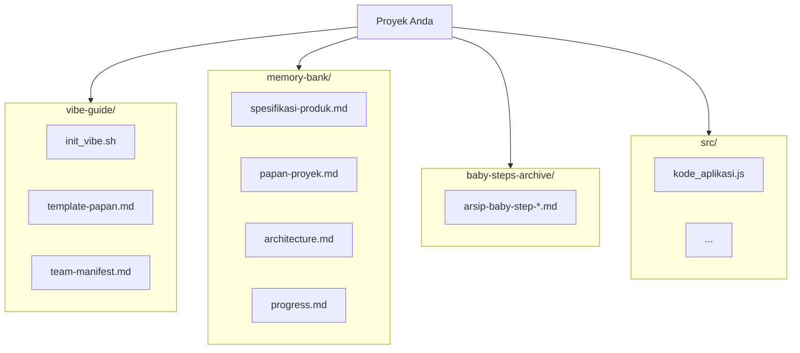

# **Panduan Vibe Coding Indonesia V1.4 (Edisi Kolaborasi Hibrida)**

**Selamat datang di Vibe Coding V1.4!** Panduan ini merupakan evolusi dari v1.3.3, dirancang untuk lingkungan pengembangan modern di mana **Agen AI dan Manusia berkolaborasi sebagai rekan setim yang setara**.

Filosofi inti bergeser dari "Manusia sebagai Arsitek" menjadi **"Tim Hibrida dengan Peran Fleksibel"**. Dalam model ini, setiap anggota tim, baik manusia maupun AI, memiliki tanggung jawab, dapat diberi tugas, dan berkontribusi langsung ke dalam basis kode.

## 🌟 Perubahan Fundamental dari V1.3

1.  **Tim Hibrida**: Agen AI secara resmi dianggap sebagai pengembang, dengan nama dan tanggung jawab yang tercatat.
2.  **Panduan Terintegrasi**: Seluruh panduan, template, dan skrip inisialisasi menjadi bagian dari proyek di dalam folder `vibe-guide/`.
3.  **Tugas yang Dapat Dialihkan**: Setiap tugas dalam *baby-step* kini memiliki penanggung jawab (`Assignee`) yang jelas, bisa manusia atau AI.
4.  **Otomatisasi Penuh**: Proses inisialisasi dan reset alur kerja diotomatisasi melalui skrip untuk memastikan konsistensi.
5.  **Komit oleh AI**: Agen AI diharapkan untuk melakukan `git commit` atas nama mereka sendiri, menunjukkan kepemilikan dan akuntabilitas atas pekerjaan mereka.

---

## 📂 Struktur Folder Proyek V1.4

Struktur ini dirancang untuk mendukung kolaborasi hibrida dan menjaga proyek tetap mandiri.



---

## 🚀 Tahap 0: Pengaturan Proyek Hibrida

### Langkah 0.1: Inisialisasi Proyek dengan Skrip

1. **Salin folder `vibe-guide/`** dari repositori Vibe Coding ke root folder proyek Anda
2. **Jalankan skrip inisialisasi** untuk menyiapkan seluruh struktur yang diperlukan:

```bash
# Berikan izin eksekusi dan jalankan skrip
chmod +x vibe-guide/init_vibe.sh
./vibe-guide/init_vibe.sh
```

### Langkah 0.2: Daftarkan Tim Anda
Buka file `vibe-guide/team-manifest.md` dan daftarkan semua anggota tim, baik manusia maupun AI. Ini adalah langkah krusial untuk alur kerja selanjutnya.

*(Konten untuk `vibe-guide/team-manifest.md`)*
```markdown
# Daftar Tim Proyek

| Nama Pengembang | Tipe    | Peran Utama       | Email untuk Git Commit        |
|-----------------|---------|-------------------|-------------------------------|
| Budi            | Manusia | Arsitek / Reviewer| budi@perusahaan.com           |
| AgentCody       | AI      | Implementor       | agent.cody@perusahaan.com     |
| Ani             | Manusia | Implementor       | ani@perusahaan.com            |
```

### Langkah 0.3: Buat Spesifikasi Produk yang Komprehensif
Ini adalah langkah paling fundamental untuk menentukan arah proyek Anda. Spesifikasi produk yang solid akan menjadi "otak" dari `memory-bank` yang akan memandu seluruh tim (manusia dan AI).

Untuk membuat `spesifikasi-produk.md` yang profesional dan terstruktur, kami telah menyediakan panduan mendalam.

**Wajib dibaca:** **[Lihat Panduan Pembuatan PRD Lengkap](./vibe-guide/PANDUAN_PRD.md)**.

Panduan tersebut akan memandu Anda melalui proses:
- Mendefinisikan visi, user persona, dan metrik sukses.
- Melakukan dialog mendalam dengan AI untuk memvalidasi ide.
- Menggunakan template PRD yang terbukti untuk mengisi `memory-bank/spesifikasi-produk.md` Anda.

---

## 🔄 Tahap 1 & 2: Siklus Pengembangan Hibrida

Ini adalah siklus inti yang akan terus diulang oleh tim hibrida Anda.

### Langkah 1.1: Perencanaan & Penugasan (`papan-proyek.md`)
Arsitek (biasanya manusia) merencanakan *baby-step* berikutnya dan **mengisi kolom `Assignee`** untuk setiap tugas di `memory-bank/papan-proyek.md`.

**Prompt untuk AI (Membantu Perencanaan):**
```prompt
Baca semua file di `memory-bank/` dan `vibe-guide/team-manifest.md`. Tugasmu adalah memperbarui `memory-bank/papan-proyek.md` dengan:
1.  **Status:** Ringkasan progres terakhir dari `progress.md`.
2.  **Baby-Step:** Buat 2-4 tugas kecil dengan kriteria tes yang jelas.
3.  **Assignee:** Berikan rekomendasi `Assignee` untuk setiap tugas berdasarkan peran di `team-manifest.md`.
4.  **Saran:** Berikan saran teknis atau peringatan risiko.
```

### Langkah 1.2: Implementasi oleh `Assignee`
Setiap anggota tim mengerjakan tugas yang diberikan kepada mereka.
* **Jika `Assignee` Manusia:** Bekerja seperti biasa, menulis kode dan melakukan tes lokal.
* **Jika `Assignee` Agen AI:** Manusia memicu agen AI dengan prompt yang jelas. Peran manusia di sini adalah sebagai *supervisor* atau *reviewer*.

    **Contoh Prompt Pemicu untuk Agen AI:**
    ```prompt
    Halo AgentCody,

    Tugas baru telah di-assign kepadamu di `memory-bank/papan-proyek.md`.
    [KONTEKS]: [Berikan konteks tambahan jika diperlukan, misal: "Fungsi ini akan dipanggil oleh komponen UserProfile"]
    [PERMINTAAN]:
    1. Implementasikan tugas dengan ID: [ID Tugas, misal: T1].
    2. Pastikan kode yang kamu tulis lolos kriteria tes yang tertera.
    3. Setelah selesai, siapkan perintah `git commit` dengan pesan yang sesuai format, menggunakan nama dan emailmu dari `team-manifest.md`.
    ```

### Langkah 1.3: Arsipkan & Reset Papan (Otomatis)
Setelah semua tugas di `papan-proyek.md` selesai dan dites, jalankan kembali skrip `init_vibe.sh` dengan argumen `reset`.

```bash
# Skrip ini akan mengarsipkan papan, mencatat progres, dan menyiapkan papan baru
./vibe-guide/init_vibe.sh --reset
```

### Langkah 1.4: Commit oleh `Assignee`
Ini adalah langkah paling penting dalam kolaborasi hibrida. Siapa pun yang mengerjakan tugas, **dialah yang melakukan commit**.

* **Pengembang Manusia:**
    ```bash
    git add .
    git commit -m "Feat(Budi): Implementasi header utama"
    ```
* **Agen AI (dieksekusi oleh *runner* otomatis):**
    ```bash
    git add .
    git commit -m "Fix(AgentCody): Perbaikan validasi email di form login

    Menyelesaikan tugas T2. Tes lokal berhasil.
    Arsip: baby-steps-archive/baby-step-20250616-1157.md"
    ```
---