# Team Roles - Vibe Coding

**Definisi peran dan tanggung jawab dalam tim hibrida manusia-AI.**

---

## 🏗️ Struktur Tim Hibrida

### Hubungan Antar Peran

```mermaid
graph TD
    A[🏛️ Arsitek] --> B[💻 Dev Frontend]
    A --> C[⚙️ Dev Backend]
    A --> D[🧪 Tester]
    B --> E[📚 Dokumenter]
    C --> E
    D --> E
    D --> B
    D --> C

    subgraph "Manusia"
        A
        B
        D
        E
    end

    subgraph "AI/Manusia"
        C
    end

    style A fill:#e3f2fd
    style B fill:#e8f5e8
    style C fill:#fff3e0
    style D fill:#fce4ec
    style E fill:#f3e5f5
```


### Alur Kolaborasi

```mermaid
sequenceDiagram
    participant AR as 🏛️ Arsitek
    participant DF as 💻 Frontend
    participant DB as ⚙️ Backend
    participant TE as 🧪 Tester
    participant DO as 📚 Dokumenter

    AR->>DF: Berikan desain UI
    AR->>DB: Berikan spesifikasi API
    DF->>DB: Konfirmasi endpoint yang dibutuhkan
    DB->>DF: Implementasi API selesai
    DF->>TE: Siap untuk pengujian
    TE->>DF: Laporan hasil testing
    TE->>DB: Laporan hasil testing
    DF->>DO: Update dokumentasi UI
    DB->>DO: Update dokumentasi API
    DO->>AR: Progress report
```


---

## 👥 Peran Inti

### 🏛️ Arsitek
**Focus:** "Apa dan Mengapa" - Strategic Planning & System Design

**Tanggung Jawab:**
- Merancang arsitektur sistem tingkat tinggi
- Menerjemahkan requirements ke desain teknis
- Memecah fitur besar menjadi baby-steps yang manageable
- Review code untuk kesesuaian dengan arsitektur
- Menjaga kualitas teknis dan consistency

**Skills:**
- System design
- Technology selection
- Requirements analysis
- Code review

**Typical Tasks:**
- Design database schema
- Define API structure
- Plan feature breakdown
- Review implementation approach

---

### 💻 Developer (Frontend/Backend)
**Focus:** "Bagaimana" - Implementation & Code Quality

**Frontend Developer:**
- Build user interface components
- Implement user interactions
- Handle responsive design
- Manage state and data flow

**Backend Developer:**
- Build API endpoints
- Handle business logic
- Manage database operations
- Implement security measures

**Skills:**
- Programming languages
- Framework proficiency
- Problem-solving
- Testing and debugging

**Typical Tasks:**
- Implement features based on design
- Write unit/integration tests
- Fix bugs
- Optimize performance

---

### 🧪 Tester
**Focus:** Quality Assurance & User Experience

**Tanggung Jawab:**
- Validate feature functionality
- Test edge cases and error scenarios
- Ensure user experience meets requirements
- Document bugs and issues
- Verify fixes and improvements

**Skills:**
- Test planning and execution
- Bug identification and reporting
- User empathy
- Attention to detail

**Typical Tasks:**
- Test baby-step completion
- Verify acceptance criteria
- Document test results
- Report bugs with reproduction steps

---

### 📚 Dokumenter
**Focus:** Knowledge Management & Communication

**Tanggung Jawab:**
- Update memory bank dengan progress terbaru
- Document technical decisions dan learnings
- Maintain team communication clarity
- Create user-facing documentation
- Ensure knowledge transfer

**Skills:**
- Technical writing
- Information organization
- Communication
- Knowledge synthesis

**Typical Tasks:**
- Update progress.md setelah baby-step
- Document API changes
- Create user guides
- Sync team understanding

---

## 🤖 AI Team Members

### Jenis AI Roles

**AI Developer:**
- Spesialisasi dalam implementasi kode
- Kuat dalam pattern recognition dan code generation
- Ideal untuk repetitive tasks dan well-defined problems

**AI Analyst:**
- Spesialisasi dalam data analysis dan troubleshooting
- Kuat dalam root cause analysis
- Ideal untuk debugging dan optimization

**AI Designer:**
- Spesialisasi dalam UI/UX design patterns
- Kuat dalam component design dan styling
- Ideal untuk consistent UI implementation

### Karakteristik AI Team Members
- **Consistency:** Selalu menghasilkan output dengan kualitas seragam
- **Speed:** Bekerja cepat untuk tasks yang well-defined
- **Pattern Recognition:** Kuat dalam mengidentifikasi dan mengikuti patterns
- **Documentation:** Secara natural mendokumentasikan asumsi dan reasoning

---

## 🔄 Role Interactions

### Arsitek ↔ Developer
```
Arsitek: "Here's the API design for user management"
Developer: "Question: Should we include soft delete?"
Arsitek: "Good point. Add deleted_at timestamp"
```

### Developer ↔ Tester
```
Developer: "Feature ready for testing"
Tester: "Found edge case with empty input. Documented in ticket"
Developer: "Fix implemented and ready for retest"
```

### Human ↔ AI
```
Human: "Implement user authentication with JWT"
AI: "I'll create login endpoint with token validation. Should I include refresh tokens?"
Human: "Not in this baby-step. Focus on basic login first"
```

### All ↔ Dokumenter
```
Team: "Baby-step completed"
Dokumenter: "Updating memory bank with progress and learnings"
```

---

## 📋 Role Assignment Matrix

| Task Type | Ideal Assignee | Rationale |
|-----------|---------------|-----------|
| System Architecture | Arsitek (Human) | Requires strategic thinking |
| API Implementation | AI Developer | Well-defined patterns |
| UI/UX Design | Frontend Dev (Human) | Requires user empathy |
| Database Schema | Arsitek + AI Backend | Balance strategy and implementation |
| Bug Fixing | Developer (Human/AI) | Depends on complexity |
| Testing | Tester (Human) | Requires creative thinking |
| Documentation | AI Dokumenter | Pattern recognition and synthesis |

---

## 🎯 Best Practices per Role

### Arsitek
- ✅ Think in terms of systems, not just features
- ✅ Provide clear guidance, not micromanagement
- ✅ Document architectural decisions
- ❌ Don't get lost in implementation details

### Developer
- ✅ Follow established patterns and conventions
- ✅ Write self-documenting code
- ✅ Test your own work before handing off
- ❌ Don't deviate from agreed architecture

### Tester
- ✅ Think like a user, not just a tester
- ✅ Provide clear, actionable bug reports
- ✅ Test both happy path and edge cases
- ❌ Don't accept "good enough" without validation

### Dokumenter
- ✅ Update documentation in real-time
- ✅ Focus on clarity over comprehensiveness
- ✅ Keep information accessible and searchable
- ❌ Don't let documentation become outdated

### AI Team Members
- ✅ Ask clarifying questions when uncertain
- ✅ Document assumptions and reasoning
- ✅ Follow patterns and conventions consistently
- ❌ Don't make assumptions without validation

---

## 🚀 Role Evolution

### Starting Small
- Tim bisa dimulai dengan 2-3 orang saja
- Satu orang bisa memegang multiple roles
- Roles evolve seiring dengan kompleksitas proyek

### Scaling Up
- Tambah specialized roles saat needed
- AI bisa mengambil lebih banyak responsibilities
- Human focus beralih ke creative dan strategic tasks

### Role Flexibility
- Roles are guidelines, not rigid boxes
- Switch roles berdasarkan kebutuhan dan skills
- Focus pada delivering value, bukan defending territories

---

## 💫 Core Philosophy

**Everyone on the team is equal, regardless of being human or AI.**
**What matters is contribution, collaboration, and collective ownership.**

The goal is to create a team where:
- Every member understands their role and responsibilities
- Communication flows freely between all team members
- Quality is everyone's responsibility
- Learning and improvement happen continuously