# Vibe Coding - Metodologi Kolaborasi Manusia & AI

**Vibe Coding adalah filosofi pengembangan perangkat lunak di mana Manusia dan AI bekerja sebagai tim hibrida yang setara.**

---

## 🎯 Konsep Inti

### 1. **Tim Hibrida**
- Manusia dan AI adalah rekan setim, bukan tool
- Setiap anggota memiliki nama, peran, dan tanggung jawab
- AI memiliki ownership atas pekerjaan mereka

### 2. **Baby-Step Workflow**
- Pecah pekerjaan menjadi unit kecil (30-60 menit)
- Setiap baby-step memiliki tujuan, kriteria tes, dan assignee
- Focus selesai, bukan sempurna

### 3. **Memory Bank**
- Dokumentasi terpusat untuk konteks proyek
- Single source of truth untuk semua tim
- Selalu update setiap baby-step selesai

### 4. **Assignee System**
- Setiap tugas memiliki assignee yang jelas (manusia/AI)
- Yang mengerjakan, yang commit
- Tanggung jawab pribadi, bukan kolektif

---

## 👥 Tim Hibrida

### Peran Dasar
- **Arsitek:** Perencana strategis, desainer sistem
- **Developer (FE/BE):** Implementor fitur
- **Tester:** Validasi kualitas
- **Dokumenter:** Update dokumentasi

### Manifest Tim
Buat file sederhana:
```markdown
# Tim Proyek

| Nama | Tipe | Peran | Kontak |
|------|------|-------|--------|
| Budi | Manusia | Arsitek | budi@example.com |
| Cody | AI | Developer | cody@example.com |
```

---

## 🔄 Workflow Sederhana

### Alur Proses Keseluruhan


### Siklus Baby-Step

```mermaid
flowchart LR
    A[📝 Perencanaan] --> B[👥 Pembagian Tugas]
    B --> C[💻 Implementasi]
    C --> D[🧪 Pengujian]
    D --> E{✅ Lolos?}
    E -->|Ya| F[📚 Dokumentasi]
    E -->|Tidak| C
    F --> G[📊 Update Progress]
    G --> A

    style A fill:#e3f2fd
    style B fill:#e8f5e8
    style C fill:#fff3e0
    style D fill:#fce4ec
    style F fill:#f3e5f5
    style G fill:#e0f2f1
```


### Siklus 1 Baby-Step

**1. Perencanaan**
- Buka memory bank
- Tulis 2-4 tugas kecil
- Assign ke anggota tim

**2. Implementasi**
- Setiap assignee kerjakan tugasnya
- Testing manual/simple validation
- Yang kerja, yang commit

**3. Dokumentasi**
- Update progress di memory bank
- Catat learning/pelajaran
- Siapkan baby-step berikutnya

---

## 📁 Memory Bank Structure

### File Minimalis
```
memory-bank/
├── README.md           # Overview proyek
├── current-work.md     # Baby-step aktif
├── progress.md         # Riwayat pekerjaan
└── team.md            # Daftar tim & peran
```

### Current Work Template
```markdown
# Baby-Step: [Nama Fitur]
**Update:** [Tanggal]

## Tujuan
[Hasil akhir yang diharapkan]

## Tugas
- [ ] **T1:** [Deskripsi] | **Assignee:** [Nama] | **Tes:** [Kriteria]
- [ ] **T2:** [Deskripsi] | **Assignee:** [Nama] | **Tes:** [Kriteria]

## Status
- Progress: [0/2 selesai]
- Blocker: [Ada/Tidak ada, jelaskan]
```

---

## 💬 Prinsip Komunikasi

### Human → AI
- Berikan konteks jelas
- Spesifik pada expected outcome
- Include constraints & requirements

### AI → Human
- Jelaskan asumsi yang dibuat
- Berikan multiple options
- Confirm understanding sebelum implement

### Example Prompt
```
Halo Cody,

Context: Kita membuat halaman user profile
Task: T1 - Buat API endpoint untuk get user data
Requirements:
- Return name, email, avatar
- Error handling untuk user tidak ditemukan
- Response format JSON

Please implement this task and commit your work.
Let me know if you need clarification.
```

---

## 🎯 Focus Principles

### ✅ Do
- Simple solutions over complex
- Manual control over automation
- Clear documentation over comprehensive
- Working code over perfect architecture
- Team collaboration over individual heroics

### ❌ Don't
- Over-engineer solutions
- Build complex automation
- Create excessive documentation
- Aim for perfection in first iteration
- Work in isolation

---

## 🚀 Getting Started

### Langkah 1: Setup Tim
1. Buat `memory-bank/team.md`
2. Daftarkan semua anggota (manusia & AI)
3. Definisikan peran masing-masing

### Langkah 2: Setup Memory Bank
1. Buat folder `memory-bank/`
2. Copy template dari bagian sebelumnya
3. Initialize proyek overview

### Langkah 3: Start Working
1. Tulis baby-step pertama di `current-work.md`
2. Assign tugas ke tim
3. Mulai implementasi

---

## 📊 Measuring Success

### Indicators
- **Velocity:** Jumlah baby-step selesai per minggu
- **Quality:** Jumlah tes yang pass
- **Collaboration:** Semua anggota aktif berkontribusi
- **Learning:** Pelajaran baru di setiap cycle

### Anti-Patterns
- Baby-step yang terlalu besar (>2 jam)
- Tugas tanpa assignee jelas
- Memory bank tidak update
- Komunikasi satu arah

---

## 🌟 Philosophy

**Vibe Coding is about collaboration, not automation.**
**It's about simplicity, not complexity.**
**It's about people (and AI) working together.**

The goal is to create sustainable software development practices where human creativity and AI capabilities complement each other, rather than compete.

---

**Version:** 2.0 | **Focus:** Concepts over Tools | **Language:** Indonesia