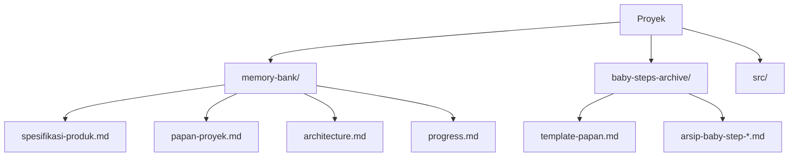

# **Panduan Vibe Coding Indonesia V1.3.3 (Edisi Terstruktur & Skalabel)**

**Selamat datang di Vibe Coding!** Panduan ini adalah evolusi dari versi sebelumnya, dirancang untuk membantumu membangun perangkat lunak berkualitas dengan alur kerja yang lebih terstruktur, tahan kesalahan, dan siap untuk proyek yang lebih besar.

Inti metode ini tetap sama: **Anda (manusia) adalah arsitek utama**, sementara **AI adalah asisten pelaksana**. Kunci keberhasilannya adalah konteks yang bersih, iterasi terukur, dan pengujian berkelanjutan.

**Perubahan Utama di V1.3.3:**
* **Struktur Folder Terpisah:** Memisahkan konteks aktif (`memory-bank`) dari riwayat pekerjaan (`baby-steps-archive`) untuk menjaga fokus AI.
* **Alur Kerja Otomatis:** Menggunakan template dan perintah terminal untuk konsistensi dan efisiensi.
* **Checkpoint Integrasi:** Langkah baru untuk memastikan semua fitur bekerja sama dengan baik secara berkala.
* **Visualisasi Alur:** Diagram untuk mempermudah pemahaman proses dari awal hingga akhir.
* **Tips & Contoh Lanjutan:** Termasuk format commit yang lebih baik dan *prompt debugging* yang efektif.

##  Filosofi Inti (Tetap Sama)

1.  **Manusia sebagai Arsitek Utama:** Anda perencana strategis, AI pelaksana teknis.
2.  **Konteks adalah Kunci:** AI membutuhkan pemahaman mendalam tentang proyek melalui "Memory Bank" yang bersih dan terstruktur.
3.  **Iterasi dengan "Baby Steps":** Pekerjaan besar dipecah menjadi tugas-tugas kecil yang dapat diuji dalam waktu 30-60 menit.
4.  **Tes Berkelanjutan:** Setiap langkah kecil harus diuji sebelum melanjutkan. Kini diperkuat dengan tes integrasi.
5.  **Dokumentasi Hidup:** Dokumen perencanaan adalah artefak yang terus diperbarui seiring progres.

## 📊 Diagram Alur Vibe Coding 1.3.3
```mermaid
flowchart TB
    A([Mulai]) --> B[Tahap 0: Setup Proyek]
    B --> C[Tahap 1: Validasi Rencana]
    C --> D{Siklus Pengembangan}
    D --> E[2.1: Update Papan-Proyek]
    E --> F[2.2: Implementasi & Tes Lokal]
    F --> G[2.3: Arsipkan & Reset Papan]
    G --> H[2.4: Git Commit]
    H --> I{Checkpoint? (tiap 3-5 baby-step)}
    I -- Ya --> J[2.5: Lakukan Tes Integrasi]
    I -- Tidak --> D
    J --> D
```

## 📂 Struktur Folder Proyek

Struktur folder baru ini adalah kunci untuk menjaga konteks AI tetap bersih.



* **`memory-bank/`**: Hanya berisi dokumen *aktif* yang relevan dengan status proyek saat ini.
* **`baby-steps-archive/`**: Menyimpan semua riwayat pekerjaan yang sudah selesai.

---

## 🚀 Tahap 0: Pengaturan Proyek

### Langkah 0.1: Inisialisasi Struktur
Jalankan perintah ini di terminal untuk membuat semua folder dan file yang diperlukan.
```bash
# Inisialisasi struktur folder utama
mkdir -p memory-bank baby-steps-archive src

# Buat file-file kerja di memory-bank
touch memory-bank/{spesifikasi-produk,papan-proyek,architecture,progress}.md

# Buat file template di arsip dan salin ke papan-proyek awal
touch baby-steps-archive/template-papan.md
cp baby-steps-archive/template-papan.md memory-bank/papan-proyek.md
```

### Langkah 0.2: Buat Template Papan-Proyek
Isi file `baby-steps-archive/template-papan.md` dengan template ini. Ini akan menjadi master template Anda.
```markdown
### STATUS [Update: <tanggal>]
- *Tulis ringkasan progres terakhir di sini.*

### REFERENSI ARSIP
- *Link ke baby-step sebelumnya yang relevan: baby-step-YYYYMMDD.md*

### BABY-STEP BERJALAN: <Nama-Fitur-Spesifik>
- **Tujuan:** *Jelaskan hasil akhir yang diharapkan dari baby-step ini.*
- **Tugas:**
    - [ ] **T1:** Deskripsi tugas | **File:** `path/ke/file` | **Tes:** Kriteria sukses yang jelas & terukur.
    - [ ] **T2:** ... | **File:** ... | **Tes:** ...

### SARAN & RISIKO
- *(Bagian ini akan diisi oleh Gemini untuk memberikan saran atau peringatan risiko teknis)*
```

### Langkah 0.3: Buat Spesifikasi Produk dengan AI
Minta AI untuk membantu Anda merancang spesifikasi awal berdasarkan ide proyek Anda.
**Prompt untuk Gemini:**
```prompt
Saya akan melakukan vibe coding. Berdasarkan ide proyek ini, tolong bantu saya membuat draf awal untuk file `memory-bank/spesifikasi-produk.md`. Isinya harus mencakup:
1. Visi & Fitur Utama (maksimal 1 halaman).
2. Rekomendasi Tumpukan Teknologi (Tech Stack) beserta alasannya.
3. Rencana Implementasi Awal untuk MVP dalam bentuk poin-poin aksi.

Berikut adalah ide utama proyek saya: [Jelaskan ide proyek Anda secara singkat di sini]
```

## ✅ Tahap 1: Validasi Rencana
Sebelum menulis kode, Anda sebagai arsitek harus memvalidasi rencana.
  - [ ] Apakah `Tech Stack` di `spesifikasi-produk.md` sudah tepat?
  - [ ] Apakah ada bagian dari `Rencana MVP` yang terasa terlalu rumit?
  - [ ] Pikirkan 1-2 potensi masalah dengan rencana ini.

Jika ragu, konsultasikan dengan AI.

---

## 🔄 Tahap 2: Siklus Pengembangan Iteratif

Ini adalah siklus inti yang akan Anda ulangi terus-menerus.

### Langkah 2.1: Update Papan-Proyek
Minta Gemini untuk merencanakan *baby-step* berikutnya.
**Prompt untuk Gemini:**
```prompt
Baca semua file di `memory-bank/` dan 1-2 arsip terakhir di `baby-steps-archive/` untuk memahami konteks dan progres.

Tugasmu sekarang adalah memperbarui file `memory-bank/papan-proyek.md`.
1.  **Status:** Tulis ringkasan singkat progres terakhir dari `progress.md`.
2.  **Referensi Arsip:** Cantumkan 1-2 arsip baby-step yang relevan.
3.  **Baby-Step:** Buat 2-4 tugas yang sangat kecil (<60 menit/tugas), logis, dan punya kriteria tes yang jelas.
4.  **Saran:** Berikan saran untuk prioritas berikutnya atau peringatan jika ada risiko teknis.
```

### Langkah 2.2: Implementasi & Tes Lokal
**Pembagian Peran:**
- **AI:** Menulis kode sesuai spesifikasi tugas
- **Anda:** Review kode, tes manual, dan validasi hasil

Gunakan asisten AI di IDE Anda untuk mengerjakan tugas di `papan-proyek.md`. Setelah AI selesai, **Anda wajib melakukan tes manual** sesuai kriteria di papan proyek.

### Langkah 2.3: Arsipkan & Reset Papan (Langkah Krusial!)
Jika semua tes lokal berhasil, jalankan perintah ini di terminal untuk mengarsipkan pekerjaan dan menyiapkan siklus berikutnya.
```bash
# 1. Arsipkan papan yang sudah selesai dengan format tanggal
mv memory-bank/papan-proyek.md baby-steps-archive/baby-step-$(date +%Y%m%d).md

# 2. Reset papan-proyek menggunakan master template
cp baby-steps-archive/template-papan.md memory-bank/papan-proyek.md

# 3. Catat progres di file progress.md
echo "$(date +%Y-%m-%d): Selesai [Nama Fitur]. Lihat arsip: baby-step-$(date +%Y%m%d).md" >> memory-bank/progress.md
```

### Langkah 2.4: Commit ke Git
Simpan pekerjaan Anda dengan pesan yang jelas dan informatif.
```bash
git add .
git commit -m "Feat: Implementasi [Nama Fitur]

Menyelesaikan semua tugas untuk fitur [Nama Fitur].
Tes lokal berhasil sesuai kriteria.

Arsip: baby-steps-archive/baby-step-$(date +%Y%m%d).md"
```

### Langkah 2.5: Checkpoint Integrasi (Setiap 3-5 Baby-Step)
Lakukan checkpoint untuk memastikan semua bagian bekerja bersama:

**Kapan melakukan checkpoint:**
- Setelah **3 baby-step** jika melibatkan integrasi antar modul/fitur
- Setelah **5 baby-step** untuk fitur yang berdiri sendiri
- Sebelum menambah fitur baru yang kompleks

Tambahkan catatan ini di `progress.md`:
```markdown
### CHECKPOINT INTEGRASI [Update: <tanggal>]
- [ ] Tes interoperabilitas antara fitur yang sudah ada.
- [ ] Validasi konsistensi data di seluruh aplikasi.
- [ ] Periksa apakah arsitektur di `architecture.md` masih relevan.
- [ ] Lakukan refactor minor jika ada duplikasi kode.
```
Setelah checkpoint selesai, lanjutkan kembali ke siklus pengembangan normal.

---

## 🛠️ Tips & Troubleshooting

### Definisi & Standar
* **Baby-Step:** Tugas yang dapat diselesaikan dalam **30-60 menit** dengan kriteria tes yang jelas.
* **Checkpoint:** Validasi integrasi setiap 3-5 baby-step tergantung kompleksitas.
* **Tes Lokal:** Minimal bisa menjalankan fitur tanpa error, tidak perlu sempurna.

### Tips untuk Memulai
* **Mulai dari Proyek Sederhana:** Halaman biodata, kalkulator, atau to-do list adalah awal yang baik.
* **Komunikasi Efektif dengan AI:** Berikan konteks jelas dan gunakan bahasa spesifik. Jika hasil tidak sesuai, perbaiki *prompt* Anda.
* **Pentingnya Testing:** Jangan lanjut jika tes gagal. Tes sederhana sudah cukup untuk memulai.

### Tips Ahli
* **Konvensi Penamaan Arsip:** Untuk proyek tim, gunakan format `baby-step-[fitur]-[inisial]-[YYYYMMDD].md` agar lebih mudah dilacak.
* **Abaikan Papan Proyek di Git:** Tambahkan `memory-bank/papan-proyek.md` ke file `.gitignore` Anda agar tidak terjadi konflik pada tim, karena file ini terus di-reset.

### Troubleshooting
* **"AI tidak memahami konteks"**: Pastikan `spesifikasi-produk.md` dan `progress.md` sudah lengkap dan jelas.
* **"Baby-step terlalu besar"**: Pecah lagi menjadi tugas yang lebih kecil. Idealnya satu tugas bisa selesai dalam 30-60 menit.
* **"Tes gagal terus"**: Periksa kembali kriteria tes. Mungkin terlalu rumit atau tidak jelas. Sederhanakan kriteria tesnya.
* **"Git commit error: pathspec tidak ditemukan"**: **SELALU gunakan tanda petik** pada pesan commit. Contoh yang benar: `git commit -m "Feat: Implementasi fitur login"`. Tanpa tanda petik, Git akan menganggap setiap kata sebagai file terpisah.

### Recovery & Rollback Sederhana
* **Jika baby-step gagal total**: Gunakan `git reset --hard HEAD~1` untuk kembali ke commit sebelumnya, lalu pecah tugas menjadi lebih kecil.
* **Jika ada konflik saat merge**: Batalkan merge dengan `git merge --abort`, lalu selesaikan satu per satu secara manual.
* **Jika aplikasi rusak setelah integrasi**: Kembali ke checkpoint terakhir yang stabil, lalu implementasi ulang dengan baby-step yang lebih kecil.
* **Debugging dengan AI**: Jika Anda menemukan *bug*, gunakan *prompt* terstruktur untuk mendapatkan solusi.
    **Contoh Prompt Debugging:**
    ```prompt
    [ERROR]: "TypeError: Cannot read properties of undefined (reading 'name')"
    [FILE]: src/components/UserProfile.js, baris 25
    [KONTEKS]: Fungsi ini dipanggil setelah pengguna login. Commit terakhir terkait adalah 'Feat: Implementasi state management user'.
    [PERMINTAAN]:
    1. Identifikasi kemungkinan penyebab utama (root cause).
    2. Berikan 2 solusi alternatif (misal: defensive coding, perbaikan state).
    3. Sarankan kriteria tes baru untuk mencegah regresi ini di `papan-proyek.md` berikutnya.
    ```

---

## 📝 Changelog

### V1.3.3 (Edisi Terstruktur & Skalabel)
- ✨ **Struktur folder terpisah** untuk konteks aktif dan arsip
- 🔄 **Alur kerja otomatis** dengan template dan perintah terminal
- 🔍 **Checkpoint integrasi** untuk memastikan kualitas sistem
- 📊 **Diagram alur visual** untuk pemahaman yang lebih baik
- 🛠️ **Tips debugging** dan troubleshooting yang lebih komprehensif
- 📚 **Format commit** yang lebih informatif dan terstruktur

---

**Selamat coding dengan metode Vibe Coding V1.3.3!** 🚀

*Panduan ini akan terus berkembang berdasarkan feedback dan pengalaman komunitas. Jangan ragu untuk berkontribusi dan berbagi pengalaman Anda.*